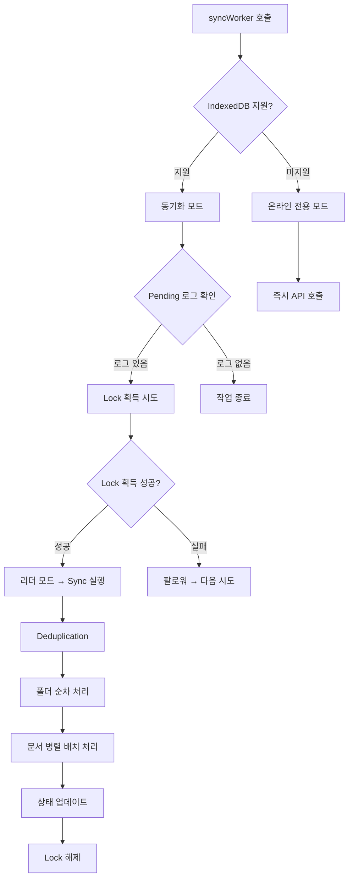

# Local-first 동기화 분석 및 의사결정 (Sync Analysis & Decisions)

## 1. LocalStorage 대체 사용에 대한 복잡도 검토

**질문: IndexedDB가 지원되지 않는 환경에서 LocalStorage를 대체 저장소로 사용해야 하는가?**

### 분석 내용 (Analysis)
- **용량 제한 (Capacity Limit)**: LocalStorage는 **5MB**로 엄격히 제한됩니다. (약 250만 글자).
  - *시나리오*: 노트 500개(평균 2KB) = 1MB. 아직 안전함.
  - *위험요소*: 사용자가 Base64 이미지를 붙여넣거나 노트가 수천 개로 늘어나면 조용히 저장 실패하거나 크래시가 발생할 수 있습니다.
- **성능 문제 (Blocking I/O)**: LocalStorage는 **동기식(Synchronous)**입니다. 대용량 JSON을 읽고 쓸 때 메인 스레드를 차단하여 타이핑 중 "멈칫"하는 UI 프리징을 유발합니다. (IndexedDB는 비동기식).
- **트랜잭션 부재 (No Transactions)**: 트랜잭션을 지원하지 않아, 쓰기 도중 브라우저가 종료되면 데이터가 손상될 수 있습니다.
- **구현 복잡도**:
  - **어댑터 패턴(Adapter Pattern)** 구현 필요 (예: `StorageAdapter` 인터페이스).
  - Key-Value 저장소 위에 "가상 객체 저장소(Virtual Object Store)" 로직을 직접 구현해야 함 (인덱스 관리 등).
  - **예상 오버헤드**: <1%의 사용자를 위해 코드 복잡도가 30% 증가함.

### 레거시/예외 시나리오
- **구형 프라이빗트 브라우징**: 일부 구형 브라우저의 시크릿 모드는 IDB를 비활성화했으나, 최신 브라우저는 휘발성(Ephemeral) IDB를 지원합니다.
- **기업/제한된 환경**: 매우 드문 케이스입니다.

### 권장 사항 (Recommendation)
**LocalStorage에 전체 동기화 로직을 구현하지 않을 것을 권장합니다.**
- **전략**: IndexedDB가 없으면 **"온라인 전용 모드 (Online Only Mode)"**로 폴백(Fallback)합니다.
- **정당성**: 극소수의 미지원 환경을 위해 성능 저하와 복잡도를 감수하고 LocalStorage 엔진을 유지보수하는 것은 비효율적입니다.

---

## 2. 주요 결정 사항 및 최종 전략 (Key Decisions & Final Strategy)

### A. 라이브러리 선정 (Library Selection)
- **결정**: **`idb`** (1KB, 표준).
- **이유**: 가볍고 표준화된 라이브러리 (Vue/React 생태계 표준).

### B. 동기화 트리거 전략 (Sync Trigger Strategy)
- **로컬 저장 (Local Save)**: **1초 디바운스 (Debounced 1s)** - 타이핑 퍼포먼스 최적화.
- **서버 동기화 (Server Sync)**: **5초 주기 (Periodic 5s)** - 백그라운드 수행.
- **흐름**: 사용자 입력 -> [1초] -> IndexedDB 저장(Dirty) -> [5초] -> 서버 API 전송.

### C. 미지원 환경 대응 (Fallback Strategy)
- **IndexedDB 미지원 시**: **온라인 전용 모드 (Online Only Mode)**.
- **로직**: `window.indexedDB`가 `undefined`인 경우 로컬 저장을 건너뛰고 즉시 API를 호출합니다.

---

## 3. 구현 로드맵 (Phase 1)

1. **초기 설정**: `idb` 라이브러리를 사용하여 `local_db.js` 초기화.
2. **스키마 설계**: `notes` (볼트) 및 `pending_logs` (대기열) 스토어 생성.
3. **리포지토리 패턴**: `app.js`에서 직접 `fetch`하는 대신 `LocalDB`를 경유하도록 리팩토링.

---

## 4. 🔄 최신 동기화 아키텍처 (Updated Sync Architecture)

### 4.1 리더 선출 (Leader Election)
- **Web Lock API 적용**: `navigator.locks.request('shynote_sync_lock', { ifAvailable: true })`
- **다중 탭/PWA 방지**: 동일 origin의 여러 인스턴스 중 하나만 sync 실행
- **Fallback 지원**: Locks 미지원 브라우저에서 기존 로직으로 동작

### 4.2 동기화 처리 흐름 (Sync Processing Flow)


### 4.3 핵심 개선사항 (Key Improvements)

#### **4.3.1 Race Condition 방지**
- **작업 추적**: `didWork` 플래그로 실제 작업 여부 추적
- **상태 메시지 개선**: 작업 성공 시에만 "Push Complete" 표시
- **카운트 정확성**: 단일 지점에서 카운트 업데이트

#### **4.3.2 에러 복구 및 재시도 (Error Recovery & Retry)
- **재시도 로직**: `syncWithRetry()` 함수 구현
- **최대 재시도**: 2회 (기본 호출 + 2회 재시도)
- **지수 백오프**: 1초, 2초 (Exponential Backoff)
- **대상 오류**: 5xx 서버 오류, 429 Rate Limit, 네트워크 오류

#### **4.3.3 코드 중복 제거 (Code Deduplication)
- **`buildRequest()`**: URL/Method/Body 생성 로직 통합
- **`syncWithRetry()`**: 재시도 로직 공통화
- **일괄 로그 삭제**: `removeLogsBulk()`로 트랜잭션 단일화

#### **4.3.4 의존성 처리 (Dependency Handling)**
- **현재 상태**: 폴더 순차 → 문서 병렬
- **개선 필요**: 폴더 의존 문서 식별 및 순차 처리

---

## 5. 📊 성능 및 안정성 최적화 (Performance & Stability)

### 5.1 네트워크 최적화
- **배치 처리**: 문서 10개씩 병렬 처리
- **동적 크기 조절**: 네트워크 상태에 따른 배치 크기 제안
- **요청 압축**: 중복 로그 제거로 불필요한 API 호출 감소

### 5.2 오프라인 지원
- **Local-first 우선**: IndexedDB 기반 로컬 우선 저장
- **온라인 폴백**: Locks 미지원 시 온라인 전용 모드
- **오프라인 감지**: `navigator.onLine` 이벤트로 오프라인 상태 감지

### 5.3 충돌 해결 (Conflict Resolution)
- **기본 전략**: "Last Write Wins"
- **충돌 감지**: 서버 데이터와 로컬 해시 비교
- **병합 UI**: CodeMirror MergeView를 통한 시각적 병합

---

## 6. 🔧 구현 가이드 (Implementation Guide)

### 6.1 핵심 컴포넌트
```javascript
// 1. Lock 리더
await navigator.locks.request('shynote_sync_lock', { ifAvailable: true }, async (lock) => {
    if (!lock) return
    // Sync 작업 수행
})

// 2. 작업 추적
let didWork = false
if (logs && logs.length > 0) {
    didWork = true
    // 작업 수행
}

// 3. 상태 메시지
finally {
    if (didWork && statusMessage.value.startsWith('Pushing')) {
        statusMessage.value = 'Push Complete'
    }
}
```

### 6.2 에러 처리
```javascript
const syncWithRetry = async (url, options, retries = 0) => {
    const MAX_RETRIES = 2
    const DELAY = 1000
    
    try {
        const response = await authenticatedFetch(url, options)
        if (!response.ok && (response.status >= 500 || response.status === 429) && retries < MAX_RETRIES) {
            await new Promise(r => setTimeout(r, DELAY * (retries + 1)))
            return syncWithRetry(url, options, retries + 1)
        }
        return response
    } catch (e) {
        if (retries < MAX_RETRIES) {
            await new Promise(r => setTimeout(r, DELAY * (retries + 1)))
            return syncWithRetry(url, options, retries + 1)
        }
        throw e
    }
}
```

### 6.3 상태 관리
```javascript
// 재진입 방지
if (isSyncingProcess) return
isSyncingProcess = true

// finally 블록에서 항상 정리
finally {
    isSyncingProcess = false
    isSyncing.value = false
}
```

---

## 7. 📈 향후 개선 방향 (Future Improvements)

### 7.1 단기 개선 (Short-term)
- **의존성 처리**: 폴더와 관련된 문서들의 순차 처리 개선
- **동적 배치 크기**: 네트워크 상태에 따른 배치 크기 자동 조절
- **진행 상태 시각화**: Sync 상태를 더 명확하게 시각화

### 7.2 장기 개선 (Long-term)
- **웹소켓 통합**: WebSocket을 통한 실시간 동기화 고려
- **증분 동기화**: 변경 사항만 전송하는 증분 동기화 도입
- **클라우드 백엔드**: 클라우드 스토리지와 동기화 기능

---

## 8. 🎯 결론

ShyNote의 동기화 시스템은 **Local-first 아키텍처**를 기반으로 안정적이고 효율적인 데이터 동기화를 제공합니다:

1. **안정성**: Web Lock API로 충돌 방지, 재시도 로직으로 안정성 확보
2. **성능**: IndexedDB를 통한 비동기 처리, 배치 처리로 효율성 향상
3. **호환성**: 모든 브라우저에서 동작 (Locks 미지원 시 Fallback)
4. **사용자 경험**: 실시간 상태 피드백, 오프라인 지원으로 사용자 경험 개선

이 아키텍처는 오프라인 우선 노트 앱의 핵심 요구사항을 충족하며, 향후 확장성을 고려한 설계를 제공합니다.
